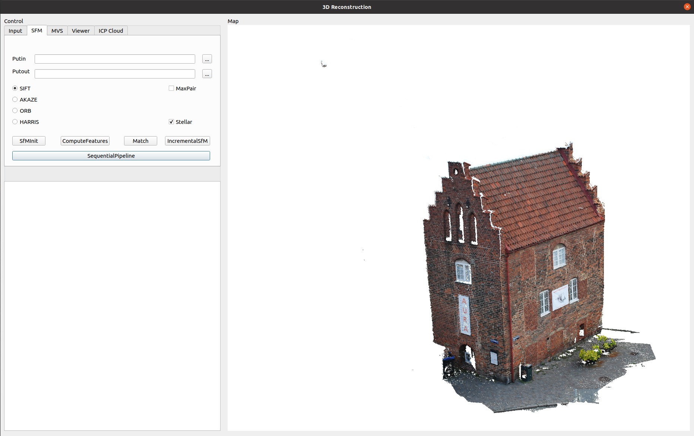

# 3DMVS
### Introduce
  本项目提供一个纯视觉三维重建解决方案，以及基于Qt的可视化桌面平台。 项目可将原始图像进行特征匹配重建为三维点云，重建深度图为3D点云，稠密重建，纹理映射，生成纹理模型。
本项目基于openMVG和openMVS库做二次开发，并加入扩展性功能， 最后用Qt设计一个Liunx系统下的 GUI桌面程序，呈现不同算子在三维重建中的效果并快速可视化。

 <table align="center">
  <tr>
    <td></td>
  </tr>
  <tr>
    
  </tr>
</table>

### Feature：
  本项目实现了如下功能：
* 基于SIFT及常用的几种特征子算法的特征提取、特征匹配的封装
* 增量sfm、三角测量、生成稀疏点云和相机姿态信息的封装
* 稠密点云生成管道封装
* 网格重建及网格精炼管道封装
* 纹理映射管道封装
* 基于GLFW库的可视化模型预览封装
* 基于openGL库的可视化模型预览及格式转换封装

### Build：
  本项目在开发时的环境如下：
* Ubunut2004
* openMVG
* openMVS
* Qt 		5.14.1
* openCV 		3.4.2 
* VCG		1.0.1
* CGAL		5.0.2
* Boost 		1.71
* Ceres 		2.0.0
* Eigen 		3.4
* GLEW		2.1.0
* GLFW		3 3.3.2
* LIBTIFF		4.1.0
* LIBPNG		1.6.37
* LIBJPEG		2.0.3
* OpenMP		4.5
* VTK		8.2
* PCL		1.13

